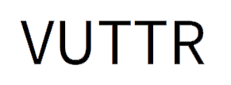
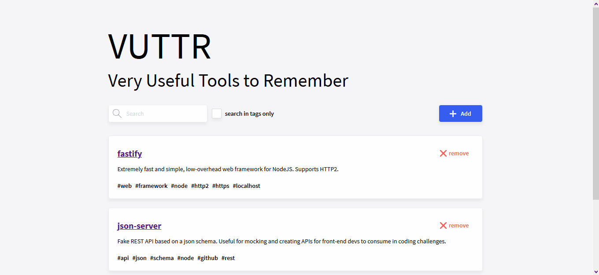

<h1 align="center">
<br>
  
<br>
<br>
Very Useful Tools to Remember
</h1>

<p align="center">Aplicação web desenvolvida para gerenciar informações sobre ferramentas utéis para desenvolvedores.</p>

<div>
  
</div>

## 📃 Sobre o projeto

Aplicação web proposta como desafio de front-end pela <a href="https://bossabox.com" target="_blank">BossaBox</a> onde objetivo é desenvolver um web app que seja capaz de armazenar informações sobre ferramentas úteis para desenvolvedores com seus respectivos nomes, links, descrições e tags, listar estas informações, filtra-las por nome e tags e apagá-las.

O front-end foi desenvolvido com ReactJS e Redux, o back-end base foi fornecido junto com o desafio e utiliza JSON Server para simular uma API REST.

## 🚀 Tecnologias utilizadas

- ⚛️ **ReactJS** — Web app
- 📋 **Formik** — Formulário de cadastro de uma ferramenta
- ✅ **Yup** — Validação do formulário de cadastro de uma ferramenta
- 🔍 **Lodash** — Debounce no filtro de ferramentas e tags
- 🖼 **Redux** — Armazenamento de estado dos componentes
- 💅 **Styled components** — Estilização dos componentes

## 💻 Rodando a aplicação

A aplicação é dividida em duas partes, front-end e back-end, o front-end precisa que o back-end esteja sendo executado para funcionar.

### Pré-requisitos

- Git
- NodeJS
- Yarn

### Rodando o back-end

Clone o repositório

```bash

# Clona o repositório
git clone https://github.com/thiagosprestes/vuttr-bossabox.git

```

Navegue até a pasta do projeto clonado e execute os comandos abaixo

```bash

# Entra na pasta do back-end
cd backend

# Inicia o back-end
npx json-server db.json -p 3333

# Acesse http://localhost:3333 para acessar o servidor caso deseje

```

### Rodando o front-end

Caso já tenha clonado o repositório basta pular a primeira etapa

```bash

# Clona o repositório
git clone https://github.com/thiagosprestes/vuttr-bossabox.git

```

Navegue até a pasta do projeto clonado e execute os comandos abaixo

```bash

# Entra na pasta do front-end
cd frontend

# Instala as dependências
yarn

```

Após instalar as dependências inicie a aplicação

```bash

# Inicia a aplicação
yarn start

# Acesse http://localhost:3000 para utilizar a aplicação 

```
